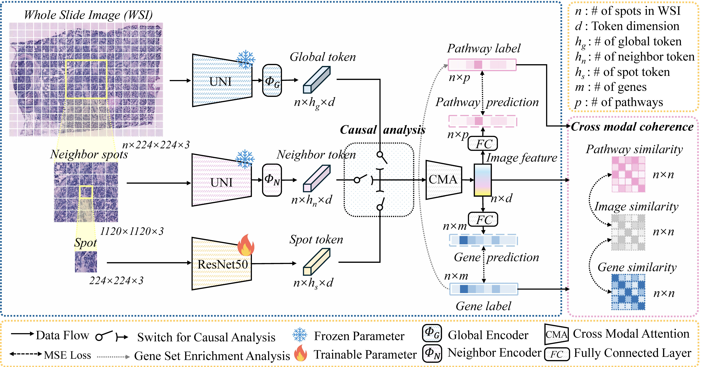

# Img2Gene: Debiased spatial gene expression prediction with biological context from pathology images

Thank you for your attention of our work. This is the codebase for Img2Gene. Please feel free to raise any question.


## Img2Gene Pipeline



## Environment

``````
Python 3.10+
PyTorch 2.0+
PyTorch Lightning 2.0+
``````

We also provide a requirement.txt file for you to track the version of each package in our setting. 


## Data Downloading

All data used in this study can be found at [Huggingface](https://huggingface.co/datasets/wzhang472/img2gene), please feel free to reach me if you have any trouble in downloading the data. After downloading all data, you will obtain below data directory:

```
	./data/
	├── her2st
    │ 		├── gt_features_224
    │ 		├── n_features_5_224
    │ 		├── ST-cnts
    │ 		├── ST-imgs
    │ 		├── ST-spotfiles
    │ 		├── ST-pathways
    │ 		└── ...
	├── skin
    │ 		└── ...
	├── stnet
    │		└── ...
    │
    └── GSE240429
    		├── adata
    		├── emb
    		├── patches
    		├── pathway
    		├── splits
    		└── ...
```


## Image Feature Extraction

If you wish to use other foundation model alternatives for her2st, skin, and stnet dataset, such as Conch, take her2st dataset as an example, the command for feature extraction can be found below:

```
python extract_features.py --config her2st/Img2Gene --test_mode internal --extract_mode target --encoder Conch
python extract_features.py --config her2st/Img2Gene --test_mode internal --extract_mode neighbor --encoder Conch
```

For GSE240429 dataset, we use the pipeline from [TRIPLEX](https://github.com/NEXGEM/TRIPLEX/tree/main/tutorials). You could download our processed data via [Huggingface](https://huggingface.co/datasets/wzhang472/img2gene) if you need.


## Training and Evaluation

Before starting training, please make sure the directories in ./config/skin/Img2Gene.yaml and ./util.py are updated accordingly to your work environments.

```
# Training
python main.py --config skin/Img2Gene --mode cv --gpu 0 --effect_type TE --num_path 35 --hyper_ig 0.1 --hyper_p 0.05 --hyper_ip 0.1 --model_name your_model

python main.py --config her2st/Img2Gene --mode cv --gpu 0 --effect_type NIE --num_path 50 --hyper_ig 0.1 --hyper_p 1 --hyper_ip 1 --model_name your_model

python main.py --config stnet/Img2Gene --mode cv --gpu 0 --effect_type NIE --num_path 37 --hyper_ig 0.1 --hyper_p 1 --hyper_ip 1 --model_name your_model

python main.py --config_name gse/Img2Gene --mode cv --gpu 0 --effect_type TE --num_path 10 --hyper_ig 1 --hyper_p 0.01 --hyper_ip 0.005 --model_name your_model


# Evaluation
python test.py --dataset skin --gpu 0 --effect_type TE --num_path 35  --model_name your_model  

python test.py --dataset her2st --gpu 0 --effect_type NIE --num_path 50  --model_name your_model

python test.py --dataset stnet --gpu 0 --effect_type NIE --num_path 37  --model_name your_model

python test.py --dataset gse --gpu 0  --effect_type TE --num_path 10 --model_name  your_model
```


## Acknowledgement

Our study builds upon previous studies: [TRIPLEX](https://github.com/NEXGEM/TRIPLEX), [UNI](https://github.com/mahmoodlab/UNI), etc. Many thanks for their opensource and the contributions to this community.


## Citation 

Please feel free to cite us if our work could be helpful for your study. Thank you.

```
@article{zhang2025img2gene,
  title={Img2Gene: debiased spatially resolved transcriptomics with biological context from pathology images},
  author={Zhang, Wei and Chen, Tong and Xu, Wenxin and Sakal, Collin and Li, Xinyue},
  journal={IEEE Journal of Biomedical and Health Informatics},
  year={2026},
  publisher={IEEE}
}
```